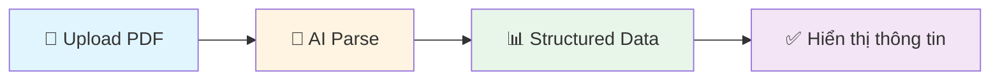

<div align="center">


# 🎯 TalentBridge

### *Nền Tảng Tìm Việc Thông Minh Cho Sinh Viên*

<p align="center">
  
  
  
  
  
</p>


**✨ Sử dụng AI để phân tích CV, gợi ý việc làm phù hợp và đánh giá chất lượng hồ sơ ✨**

<p align="center">
  <a href="#-demo"><strong>🚀 Demo</strong></a> •
  <a href="#-tính-năng"><strong>✨ Tính Năng</strong></a> •
  <a href="#-cài-đặt"><strong>📦 Cài Đặt</strong></a> •
  <a href="#-tài-liệu"><strong>📖 Tài Liệu</strong></a> •
  <a href="#-đóng-góp"><strong>🤝 Đóng Góp</strong></a>
</p>

---

</div>

## 📋 Mục Lục

<div align="center">

| [Giới Thiệu](#-giới-thiệu) | [Tính Năng](#-tính-năng) | [Công Nghệ](#-công-nghệ) | [Kiến Trúc](#-kiến-trúc-hệ-thống) |
|:--:|:--:|:--:|:--:|
| [Cài Đặt](#-cài-đặt) | [Sử Dụng](#-sử-dụng) | [API Docs](#-api-documentation) | [Roadmap](#-roadmap) |

</div>

---

## 🎯 Giới Thiệu

<div align="center">

**TalentBridge** là nền tảng tìm việc làm thông minh được xây dựng đặc biệt cho sinh viên Việt Nam.  
Sử dụng sức mạnh của **Google Gemini AI** và **Semantic Search**, TalentBridge giúp sinh viên:

</div>

<table align="center">
<tr>
<td align="center" width="25%">
  
  <br/><strong>Phân tích CV tự động</strong>
  <br/><sub>Upload PDF và AI sẽ đọc, hiểu toàn bộ nội dung</sub>
</td>
<td align="center" width="25%">
  
  <br/><strong>Gợi ý việc làm phù hợp</strong>
  <br/><sub>Tìm công việc match với kỹ năng và kinh nghiệm</sub>
</td>
<td align="center" width="25%">
  
  <br/><strong>Đánh giá chất lượng CV</strong>
  <br/><sub>AI chấm điểm và đưa ra lời khuyên cải thiện</sub>
</td>
<td align="center" width="25%">
  
  <br/><strong>Phân tích thị trường</strong>
  <br/><sub>Thống kê xu hướng tuyển dụng và insights</sub>
</td>
</tr>
</table>

---

### 🌟 Điểm Đặc Biệt

<div align="center">

| ✅ **100% Tự Động** | ✅ **AI Thông Minh** | ✅ **Semantic Search** |
|:------------------:|:-------------------:|:---------------------:|
| Không cần nhập tay thông tin CV | Sử dụng Google Gemini 2.5 Flash | Tìm việc theo nghĩa, không chỉ từ khóa |

| ✅ **Tiếng Việt** | ✅ **3,237 Công Việc** | ✅ **Open Source** |
|:----------------:|:---------------------:|:-----------------:|
| Giao diện và nội dung hoàn toàn tiếng Việt | Dữ liệu thực tế từ TopCV | MIT License - Miễn phí sử dụng |

</div>

---

## ✨ Tính Năng

<details open>
<summary><h3>🤖 1. Phân Tích CV Thông Minh</h3></summary>

<div align="center">



</div>

- **Upload PDF** - Kéo thả hoặc chọn file CV
- **AI Parse** - Gemini AI tự động đọc và trích xuất thông tin
- **Structured Data** - Chuyển đổi sang JSON với đầy đủ thông tin:
  - 👤 Thông tin cá nhân (tên, email, phone)
  - 💪 Kỹ năng (skills)
  - 🎓 Học vấn (education)
  - 💼 Kinh nghiệm (experience)
  - 🎯 Mục tiêu nghề nghiệp (career objective)

</details>

<details>
<summary><h3>📊 2. Đánh Giá Chất Lượng CV</h3></summary>

<div align="center">

**3 Điểm Số Chính:**

| 🎯 Quality Score | 💼 Market Fit Score | ✅ Completeness Score |
|:---------------:|:------------------:|:--------------------:|
| Chất lượng tổng thể (0-10) | Phù hợp với thị trường (0-10) | Đầy đủ thông tin (0-10) |

</div>

**Phân Tích Chi Tiết:**
- ✅ **Điểm Mạnh** - Những gì bạn làm tốt
- ⚠️ **Điểm Yếu** - Những gì cần cải thiện  
- 💡 **Gợi Ý** - Lời khuyên cụ thể từ AI

</details>

<details>
<summary><h3>🎯 3. Tìm Việc Phù Hợp (Semantic Matching)</h3></summary>

<div align="center">

```
CV của bạn → [AI Embedding] → Vector 768 chiều
                                    ↓
                            [ChromaDB Search]
                                    ↓
                        3,237 công việc → Top 5 matched
                                    ↓
                        [Gemini AI Ranking] → Score 0-100%
```

</div>

- **Semantic Search** - Tìm kiếm theo nghĩa với ChromaDB
- **AI Ranking** - Gemini AI xếp hạng độ phù hợp (0-100%)
- **Smart Filters:**
  - 📍 Địa điểm (Hà Nội, HCM, Đà Nẵng...)
  - 💰 Mức lương (10-50 triệu)
  - 📅 Kinh nghiệm (0-5+ năm)
  - 💼 Loại công việc (Full-time, Part-time, Remote)
- **Giải Thích AI** - "Tại sao công việc này phù hợp với bạn?"

</details>

<details>
<summary><h3>📈 4. Dashboard Analytics</h3></summary>

<div align="center">

**6 Biểu Đồ Thống Kê:**

| 📊 Top Vị Trí | 🏢 Top Công Ty | 📍 Địa Điểm |
|:------------:|:-------------:|:----------:|
| 💼 Loại Công Việc | 📅 Kinh Nghiệm | 💰 Mức Lương |

</div>

- **AI Insights** - Phân tích xu hướng và gợi ý cho sinh viên
- **Interactive Charts** - Chart.js với animation mượt mà
- **Real-time Data** - Dữ liệu cập nhật từ database

</details>

<details>
<summary><h3>🔍 5. Tìm Kiếm & Lọc Việc Làm</h3></summary>

- ✅ **3,237 Công Việc** thực tế từ TopCV
- 🔍 **Tìm Kiếm Nâng Cao** - Theo từ khóa, địa điểm, lương
- 📄 **Pagination** - 20 jobs/page
- 🔀 **Sort** - Theo mới nhất, lương, deadline

</details>

---

## 🛠️ Công Nghệ

<div align="center">

### Backend Stack

<table>
<thead>
<tr>
<th align="center">Công Nghệ</th>
<th align="center">Phiên Bản</th>
<th align="center">Mục Đích</th>
</tr>
</thead>
<tbody>
<tr>
<td align="center"></td>
<td align="center">3.12+</td>
<td align="center">Ngôn ngữ chính</td>
</tr>
<tr>
<td align="center"></td>
<td align="center">Latest</td>
<td align="center">Web framework (async)</td>
</tr>
<tr>
<td align="center"></td>
<td align="center">Latest</td>
<td align="center">ASGI server</td>
</tr>
<tr>
<td align="center"></td>
<td align="center">2.5 Flash</td>
<td align="center">LLM - Parse, Analyze, Rank</td>
</tr>
<tr>
<td align="center"></td>
<td align="center">Latest</td>
<td align="center">Vector database</td>
</tr>
<tr>
<td align="center"></td>
<td align="center">3.x</td>
<td align="center">Relational database</td>
</tr>
<tr>
<td align="center"></td>
<td align="center">Latest</td>
<td align="center">RAG framework</td>
</tr>
<tr>
<td align="center"></td>
<td align="center">V2</td>
<td align="center">Data validation</td>
</tr>
</tbody>
</table>

### Frontend Stack

<table>
<thead>
<tr>
<th align="center">Công Nghệ</th>
<th align="center">Mục Đích</th>
</tr>
</thead>
<tbody>
<tr>
<td align="center"></td>
<td align="center">Logic (Vanilla JS)</td>
</tr>
<tr>
<td align="center"></td>
<td align="center">Biểu đồ thống kê</td>
</tr>
<tr>
<td align="center"></td>
<td align="center">Preview PDF</td>
</tr>
<tr>
<td align="center"></td>
<td align="center">UI components</td>
</tr>
</tbody>
</table>

### AI Models

<table>
<tr>
<td width="50%">

**🤖 Gemini 2.5 Flash** (`gemini-2.5-flash`)
- ✅ Parse CV từ PDF → JSON
- ✅ Phân tích chất lượng CV
- ✅ Ranking jobs (score 0-1)
- ✅ Giải thích "Tại sao phù hợp"
- ✅ Phân tích biểu đồ dashboard

</td>
<td width="50%">

**🔍 Gemini Embedding** (`text-embedding-004`)
- ✅ Tạo vector 768 chiều
- ✅ Semantic search jobs
- ✅ Cosine similarity matching

</td>
</tr>
</table>

</div>

---

## 🏗️ Kiến Trúc Hệ Thống

<div align="center">

```
┌─────────────────────────────────────────────────────────────┐
│                        FRONTEND                             │
│  ┌──────────┐  ┌──────────┐  ┌──────────┐  ┌──────────┐   │
│  │  index   │  │cv-analysis│  │  jobs    │  │dashboard │   │
│  │  .html   │  │   .html   │  │_new.html │  │  .html   │   │
│  └────┬─────┘  └─────┬─────┘  └────┬─────┘  └────┬─────┘   │
│       │              │              │             │         │
│       └──────────────┴──────────────┴─────────────┘         │
│                          │                                  │
│                    Fetch API (HTTP)                         │
└──────────────────────────┼──────────────────────────────────┘
                           │
┌──────────────────────────▼──────────────────────────────────┐
│                    FASTAPI BACKEND                          │
│  ┌────────────────────────────────────────────────────┐     │
│  │  api/main.py - 15+ REST API Endpoints             │     │
│  │  • POST /upload-cv                                 │     │
│  │  • GET /cv/{cv_id}/insights                        │     │
│  │  • POST /match (Semantic Matching)                 │     │
│  │  • GET /jobs, /jobs/{job_id}                       │     │
│  │  • GET /jobs/analytics                             │     │
│  └────┬───────────────────────────┬────────────────┬──┘     │
│       │                           │                │        │
│  ┌────▼─────┐  ┌─────────────────▼──┐  ┌─────────▼──────┐ │
│  │ AI       │  │ LangChain         │  │ Database       │ │
│  │ Analysis │  │ Utils             │  │ Utils          │ │
│  │          │  │ (RAG + Matching)  │  │                │ │
│  └────┬─────┘  └─────────┬─────────┘  └────┬───────────┘ │
└───────┼──────────────────┼─────────────────┼──────────────┘
        │                  │                 │
┌───────▼──────┐  ┌────────▼────────┐  ┌────▼──────────────┐
│ Google       │  │ ChromaDB        │  │ SQLite            │
│ Gemini AI    │  │ Vector Store    │  │ cv_job_matching.db│
│              │  │                 │  │                   │
│ • Parse CV   │  │ • 3,237 jobs    │  │ • cv_store        │
│ • Analyze    │  │ • 768-dim       │  │ • job_store       │
│ • Rank       │  │   embeddings    │  │ • cv_insights     │
│ • Explain    │  │ • Semantic      │  │ • match_logs      │
│              │  │   search        │  │ • applications    │
└──────────────┘  └─────────────────┘  └───────────────────┘
```

</div>

---

## 📦 Cài Đặt

### Yêu Cầu Hệ Thống

<div align="center">

| 🐍 Python | 💾 RAM | 💿 Storage |
|:--------:|:------:|:----------:|
| 3.12+ | 4GB (khuyến nghị 8GB) | 2GB |

</div>

### Bước 1️⃣: Clone Repository

```bash
git clone https://github.com/Trinhvhao/TalentBridge.git
cd TalentBridge
```

### Bước 2️⃣: Tạo Virtual Environment

```bash
# Windows
python -m venv rag_env
rag_env\Scripts\activate

# Linux/Mac
python3 -m venv rag_env
source rag_env/bin/activate
```

### Bước 3️⃣: Cài Đặt Dependencies

```bash
pip install -r requirements.txt
```

### Bước 4️⃣: Setup API Keys

Tạo file `.env` trong thư mục gốc:

```bash
# 3 API keys để tránh quota limit (150 requests/day thay vì 50)
GOOGLE_API_KEY_1=AIzaSy...
GOOGLE_API_KEY_2=AIzaSy...
GOOGLE_API_KEY_3=AIzaSy...
```

**🔑 Lấy API Key:**
1. Truy cập https://aistudio.google.com/apikey
2. Tạo 3 API keys (miễn phí)
3. Copy vào file `.env`

### Bước 5️⃣: Chạy Server

```bash
python main.py
```

**✅ Output:**
```
============================================================
🚀 TalentBridge - Nền Tảng Tìm Việc Thông Minh
============================================================
📍 Server đang khởi động...
🌐 URL: http://localhost:9990
📚 API Docs: http://localhost:9990/docs
============================================================
INFO:     Uvicorn running on http://0.0.0.0:9990
✅ Preloading completed
INFO:     Application startup complete.
```

### Bước 6️⃣: Truy Cập Ứng Dụng

<div align="center">

| 🌐 Frontend | 📚 API Docs | 🔌 API Base |
|:----------:|:-----------:|:-----------:|
| `frontend/index.html` | `http://localhost:9990/docs` | `http://localhost:9990` |

</div>

---

## 🚀 Sử Dụng

### 1️⃣ Upload & Phân Tích CV

```bash
# Mở trang cv-analysis.html
1. Kéo thả file CV.pdf vào khung upload
2. Click "Upload CV"
3. Xem thông tin được AI parse tự động
4. Click "Phân Tích CV" để xem điểm số
5. Click "Gợi Ý Cải Thiện" để nhận lời khuyên
```

### 2️⃣ Tìm Việc Phù Hợp

```bash
# Sau khi upload CV
1. Click "Tìm Việc Phù Hợp"
2. Chọn filters (location, salary, experience)
3. Xem top 5 jobs matched với % phù hợp
4. Đọc "Tại sao phù hợp" do AI giải thích
5. Click "Xem Chi Tiết" hoặc "Ứng Tuyển"
```

### 3️⃣ Xem Dashboard

```bash
# Mở dashboard.html
1. Xem 6 biểu đồ thống kê thị trường
2. Click "Phân Tích AI" trên mỗi biểu đồ
3. Đọc insights và gợi ý từ AI
```

---

## 📖 API Documentation

<div align="center">

### 📚 Swagger UI

Truy cập [http://localhost:9990/docs](http://localhost:9990/docs) để xem API documentation đầy đủ

### Endpoints Chính

<table>
<thead>
<tr>
<th align="center">Method</th>
<th align="center">Endpoint</th>
<th align="center">Mô Tả</th>
</tr>
</thead>
<tbody>
<tr>
<td align="center"><code>POST</code></td>
<td align="center"><code>/upload-cv</code></td>
<td align="center">Upload và parse CV</td>
</tr>
<tr>
<td align="center"><code>GET</code></td>
<td align="center"><code>/cvs</code></td>
<td align="center">Lấy danh sách CVs</td>
</tr>
<tr>
<td align="center"><code>GET</code></td>
<td align="center"><code>/cv/{cv_id}/insights</code></td>
<td align="center">Phân tích CV</td>
</tr>
<tr>
<td align="center"><code>POST</code></td>
<td align="center"><code>/cv/improve</code></td>
<td align="center">Gợi ý cải thiện CV</td>
</tr>
<tr>
<td align="center"><code>POST</code></td>
<td align="center"><code>/match</code></td>
<td align="center">⭐ Tìm việc phù hợp (Semantic)</td>
</tr>
<tr>
<td align="center"><code>POST</code></td>
<td align="center"><code>/jobs/search</code></td>
<td align="center">Tìm kiếm jobs theo từ khóa</td>
</tr>
<tr>
<td align="center"><code>GET</code></td>
<td align="center"><code>/jobs</code></td>
<td align="center">Lấy danh sách jobs</td>
</tr>
<tr>
<td align="center"><code>GET</code></td>
<td align="center"><code>/jobs/{job_id}</code></td>
<td align="center">Chi tiết job</td>
</tr>
<tr>
<td align="center"><code>GET</code></td>
<td align="center"><code>/jobs/analytics</code></td>
<td align="center">Thống kê thị trường</td>
</tr>
<tr>
<td align="center"><code>POST</code></td>
<td align="center"><code>/jobs/analytics/insights</code></td>
<td align="center">AI phân tích biểu đồ</td>
</tr>
</tbody>
</table>

**📘 Chi tiết:** Xem [docs/API_ENDPOINTS_GUIDE.md](docs/API_ENDPOINTS_GUIDE.md)

</div>

---

## 📚 Tài Liệu

<div align="center">

| 📘 API Guide | 📗 Project Docs |
|:------------:|:---------------:|
| [API Endpoints Guide](docs/API_ENDPOINTS_GUIDE.md) | [Project Documentation](docs/PROJECT_DOCUMENTATION.md) |
| Hướng dẫn chi tiết tất cả API endpoints | Tài liệu kỹ thuật đầy đủ |

</div>

---

## 🎓 Roadmap

<div align="center">

<table>
<tr>
<td width="50%">

### 🔜 Upcoming Features

- [ ] 🔐 **Authentication** - Login/Register với JWT
- [ ] 💬 **Chatbot Tư Vấn** - AI chatbot tư vấn nghề nghiệp
- [ ] 🎯 **Recommendation System** - Gợi ý jobs dựa trên lịch sử

</td>
<td width="50%">

### 🚀 Future Plans

- [ ] 📧 **Email Notifications** - Thông báo jobs mới
- [ ] 📱 **Mobile App** - React Native app
- [ ] ☁️ **Deploy Cloud** - AWS/GCP deployment
- [ ] 🌍 **Multi-language** - English support

</td>
</tr>
</table>

</div>

---

## 🤝 Đóng Góp

<div align="center">

**Contributions, issues và feature requests đều được chào đón!**

```bash
1️⃣ Fork repository
2️⃣ Tạo branch (git checkout -b feature/AmazingFeature)
3️⃣ Commit changes (git commit -m 'Add some AmazingFeature')
4️⃣ Push to branch (git push origin feature/AmazingFeature)
5️⃣ Mở Pull Request
```

</div>

---

## 📄 License

<div align="center">

Distributed under the **MIT License**. See `LICENSE` for more information.

</div>

---

## 👨‍💻 Tác Giả

<div align="center">

**Trịnh Văn Hào**

[](https://github.com/Trinhvhao)
[](mailto:haotrinh142@gmail.com)

</div>

---

## 🙏 Acknowledgments

<div align="center">

<table>
<tr>
<td align="center">
  <a href="https://ai.google.dev/">
    <br/>
    <sub><b>Google Gemini AI</b></sub>
  </a>
</td>
<td align="center">
  <a href="https://fastapi.tiangolo.com/">
    <br/>
    <sub><b>FastAPI</b></sub>
  </a>
</td>
</tr>
